# All-in-One Flight Travel Preparation Program

[My Notes](notes.md)

The Flight Information Dashboard is a robust web application designed to help users seamlessly manage and access their flight details. With this app, users can enter their ticket information to instantly view flight data such as departure and arrival times, flight status, and airport-specific details. Flights are categorized into "Upcoming" and "Past" sections for better organization, and all information is securely stored to eliminate the need for repeated entries. By leveraging AWS cloud infrastructure, the application offers scalability, reliability, and high availability while maintaining a high standard of security and performance.

> [!NOTE]
>  This is a template for your startup application. You must modify this `README.md` file for each phase of your development. You only need to fill in the section for each deliverable when that deliverable is submitted in Canvas. Without completing the section for a deliverable, the TA will not know what to look for when grading your submission. Feel free to add additional information to each deliverable description, but make sure you at least have the list of rubric items and a description of what you did for each item.

> [!NOTE]
>  If you are not familiar with Markdown then you should review the [documentation](https://docs.github.com/en/get-started/writing-on-github/getting-started-with-writing-and-formatting-on-github/basic-writing-and-formatting-syntax) before continuing.

***

## 🚀 Specification Deliverable

> [!NOTE]
>  Fill in this sections as the submission artifact for this deliverable. You can refer to this [example](https://github.com/webprogramming260/startup-example/blob/main/README.md) for inspiration.

For this deliverable I did the following. I checked the box `[x]` and added a description for things I completed.

- [X] Proper use of Markdown
- [X] A concise and compelling elevator pitch
- [X] Description of key features
- [X] Description of how you will use each technology
- [x] One or more rough sketches of your application. Images must be embedded in this file using Markdown image references.

***

## Elevator Pitch

The Flight Information Dashboard is an advanced application that empowers users to track, manage, and access detailed flight information in real-time. It categorizes flights into "Upcoming" and "Past," integrates real-time flight APIs, and leverages AWS for scalable performance. With intuitive navigation and robust security, the platform streamlines the user experience, enabling effortless access to all flight-related data.

***

## Designs and Diagram

### Login Page

### Flight Selection Page

### Flight Info Page

### Login Sequence Diagram

### Flight Data Retrieval Sequence Diagram

```mermaid
sequenceDiagram
actor user as User <br> [Device]
participant client as Client
participant web as Web Server
participant data as Database
participant api as FlightAPI

Note over client,data: User Login & Registration
user ->>+ client: Login/Register
client -) web: Log user request
client ->>+ data: Authenticate user
alt Authorized
    data -->> client: User Authenticated
    client -->> user: Display dashboard
else Unauthorized
    data -->>- client: Response status
    client ->> client: Display error message
end

Note over client,api: Retrieve Flight Data
user ->>+ client: Enter Flight Ticket Info
client -) web: Send API request
client ->>+ api: Fetch flight info
api -->> client: Return flight details
client ->> client: Display flight info
```

***

## Key Features

1. **Real-Time Flight Retrieval:** Users can access up-to-date flight details, including delays, cancellations, and gate assignments, by entering their flight number or ticket details.
2. **Flight Categorization:** Flights are sorted into "Upcoming" or "Past" based on their departure and arrival times, allowing users to view their travel history effortlessly.
3. **Airport Information Display:** Comprehensive details about departure and arrival terminals, gates, and available airport facilities.
4. **Secure Authentication:** Users can register, log in, and securely store their flight information, ensuring that their data is accessible only to them.
5. **Real-Time Updates:** Push notifications alert users to any changes in flight status, such as delays or gate updates.
6. **Cloud Integration:** Hosted on AWS, the application benefits from services like EC2, RDS, and S3 for seamless and scalable performance.
7. **Responsive Design:** The app adapts to various screen sizes, providing a consistent experience across desktop, tablet, and mobile devices.
8. **Advanced Security Measures:** Encryption, input validation, and role-based access control safeguard user data from unauthorized access and potential vulnerabilities.

---
## Technologies

I am going to use the required technologies in the following ways.

### HTML

- **Semantic Structure:** Employs HTML5 to create an accessible and well-structured user interface.
- **Pages:**
  - **Login Page:** Where users authenticate themselves.
  - **Dashboard:** Displays categorized flight information for authenticated users.

### CSS

- **Responsive Design:** Implements CSS Grid and Flexbox to ensure layouts adjust to various screen sizes.
- **Styling:** Prioritizes user experience with clear fonts, interactive buttons, and hover effects.
- **Animations:** Smooth transitions and feedback for interactive elements enhance usability.

### React

- **Single Page Application (SPA):** Utilizes React to handle UI rendering and dynamic updates without page reloads.
- **Component-Based Architecture:** Breaks the application into modular components like FlightDetails, LoginForm, and FlightList.
- **React Router:** Manages navigation between views such as login, dashboard, and flight details.

### Web Services

- **Flight APIs:** Integrates with public APIs like [AviationStack](https://aviationstack.com/) or [FlightAware](https://www.flightaware.com/commercial/aeroapi/) to fetch flight information in real-time.
- **Airport APIs:** Retrieves details about airport facilities, terminals, and gates via APIs like [OpenFlights](https://openflights.org/#) and airport geo-information via API such as [AirLabs](https://airlabs.co/).

### Authentication

- **Secure Login:** Uses JSON Web Tokens (JWT) for user session management.
- **Password Security:** Hashes passwords using bcrypt before storing them in the database.

### Database

- **MongoDB:** Stores user profiles, flight data, and session information in a scalable NoSQL database.
- **AWS RDS:** Hosts a relational database to manage application data with high availability and automatic backups.
- **Data Encryption:** Protects sensitive information, such as user credentials, using AES-256 encryption.

### AWS Hosting

- **EC2 Instances:** Hosts the application’s backend, ensuring high performance and scalability.
- **S3 Buckets:** Stores static files such as CSS, JavaScript, and images for fast and reliable delivery.
- **CloudFront:** Serves as a Content Delivery Network (CDN) to reduce latency and improve global accessibility.
- **IAM Roles:** Ensures secure access to AWS resources with tightly controlled permissions.

### WebSocket

- **Real-Time Notifications:** Uses WebSocket connections to push updates, such as gate changes or delays, to the user interface without requiring manual refreshes.
- **User Alerts:** Displays real-time alerts on flight status changes directly in the dashboard.

## Security Considerations

### Data Encryption

- **TLS/SSL:** Secures all communications between the client and server using HTTPS protocols.
- **At-Rest Encryption:** Encrypts sensitive user data stored in the database with AES-256.

### Authentication and Authorization

- **JWT Authentication:** Verifies user sessions and ensures secure access to personal flight data.
- **Role-Based Access Control:** Ensures that users can access only their own flight information.

### Anti-Abuse Measures

- **Rate Limiting:** Limits API requests to prevent brute force attacks and resource abuse.
- **Captcha Implementation:** Protects registration and login endpoints from bot activities.

### Input Validation and Sanitization

- **Server-Side Validation:** Checks all inputs for proper formatting and compliance (e.g., valid email addresses, ticket numbers).
- **Sanitization:** Removes malicious content to prevent Cross-Site Scripting (XSS) and SQL Injection attacks.

### Session Management

- **Secure Storage:** Stores JWT tokens securely in HTTP-only cookies to prevent Cross-Site Request Forgery (CSRF).
- **Timeouts:** Automatically expires user sessions after a predefined period of inactivity.

## 🚀 AWS deliverable

For this deliverable I did the following. I checked the box `[x]` and added a description for things I completed.

- [ ] **Server deployed and accessible with custom domain name** - [My server link](https://yourdomainnamehere.click).

## 🚀 HTML deliverable

For this deliverable I did the following. I checked the box `[x]` and added a description for things I completed.

- [ ] **HTML pages** - I did not complete this part of the deliverable.
- [ ] **Proper HTML element usage** - I did not complete this part of the deliverable.
- [ ] **Links** - I did not complete this part of the deliverable.
- [ ] **Text** - I did not complete this part of the deliverable.
- [ ] **3rd party API placeholder** - I did not complete this part of the deliverable.
- [ ] **Images** - I did not complete this part of the deliverable.
- [ ] **Login placeholder** - I did not complete this part of the deliverable.
- [ ] **DB data placeholder** - I did not complete this part of the deliverable.
- [ ] **WebSocket placeholder** - I did not complete this part of the deliverable.

## 🚀 CSS deliverable

For this deliverable I did the following. I checked the box `[x]` and added a description for things I completed.

- [ ] **Header, footer, and main content body** - I did not complete this part of the deliverable.
- [ ] **Navigation elements** - I did not complete this part of the deliverable.
- [ ] **Responsive to window resizing** - I did not complete this part of the deliverable.
- [ ] **Application elements** - I did not complete this part of the deliverable.
- [ ] **Application text content** - I did not complete this part of the deliverable.
- [ ] **Application images** - I did not complete this part of the deliverable.

## 🚀 React part 1: Routing deliverable

For this deliverable I did the following. I checked the box `[x]` and added a description for things I completed.

- [ ] **Bundled using Vite** - I did not complete this part of the deliverable.
- [ ] **Components** - I did not complete this part of the deliverable.
- [ ] **Router** - Routing between login and voting components.

## 🚀 React part 2: Reactivity

For this deliverable I did the following. I checked the box `[x]` and added a description for things I completed.

- [ ] **All functionality implemented or mocked out** - I did not complete this part of the deliverable.
- [ ] **Hooks** - I did not complete this part of the deliverable.

## 🚀 Service deliverable

For this deliverable I did the following. I checked the box `[x]` and added a description for things I completed.

- [ ] **Node.js/Express HTTP service** - I did not complete this part of the deliverable.
- [ ] **Static middleware for frontend** - I did not complete this part of the deliverable.
- [ ] **Calls to third party endpoints** - I did not complete this part of the deliverable.
- [ ] **Backend service endpoints** - I did not complete this part of the deliverable.
- [ ] **Frontend calls service endpoints** - I did not complete this part of the deliverable.

## 🚀 DB/Login deliverable

For this deliverable I did the following. I checked the box `[x]` and added a description for things I completed.

- [ ] **User registration** - I did not complete this part of the deliverable.
- [ ] **User login and logout** - I did not complete this part of the deliverable.
- [ ] **Stores data in MongoDB** - I did not complete this part of the deliverable.
- [ ] **Stores credentials in MongoDB** - I did not complete this part of the deliverable.
- [ ] **Restricts functionality based on authentication** - I did not complete this part of the deliverable.

## 🚀 WebSocket deliverable

For this deliverable I did the following. I checked the box `[x]` and added a description for things I completed.

- [ ] **Backend listens for WebSocket connection** - I did not complete this part of the deliverable.
- [ ] **Frontend makes WebSocket connection** - I did not complete this part of the deliverable.
- [ ] **Data sent over WebSocket connection** - I did not complete this part of the deliverable.
- [ ] **WebSocket data displayed** - I did not complete this part of the deliverable.
- [ ] **Application is fully functional** - I did not complete this part of the deliverable.
